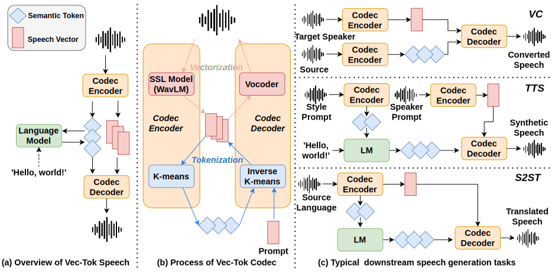

# Vec-Tok Speech
This is the official code implementation of paper [Vec-Tok Speech: Speech Vectorization and Tokenization for Neural Speech Generation](https://arxiv.org/abs/2310.07246)

This project was started as a internal experiment, so the most part of code was depend on internal toolchains and dataset. We are working hard on orgnizing and clean the code, and we will release the cleaned part step by step. 

We are also looking for community efforts and resources to reimplement this framework with open-source data and toolchain.

[[Demo Page](https://vectokdemo.github.io/VecTok/)]
[[Paper](https://arxiv.org/abs/2310.07246)]

## Overview

We propose a speech codec based on speech vectors and semantic tokens. 
- Speech vectors contain acoustic details contributing to high-fidelity speech reconstruction.
- Semantic tokens focus on the linguistic content of speech, serving effective language modeling.

Our framework has some nice property:
- Speech vectors can reconstruct to speech with high quality
- Semantic tokens with very low bitrate and token-rate(~260bps and ~20 tokens per second with K-Means($K=300$) and BPE encoding (vocab size=8192)) and few speaker information.

Theoretically, Vec-Tok can do these tasks in a unified framework:
- Zero-shot Duration invariant tasks with Inverse-KMeans Model, such as voice conversion, speaker anonymization, denoising, bandwidth extension, etc.
- Zero-shot Duration variant tasks with Language Model, such as TTS, Speech to Speech translation, and possibly other tasks like speech continuation and ASR.




## Roadmap
Release (train and inference) code and document of
- [ ]  K-Means model (entangled with internal data)
- [ ]  Feature extraction (need cleanup)
- [ ]  Vocoder (entangled with internal data)
- [ ]  Vec-Tok Codec (entangled with internal tool and data, need cleanup)
- [ ]  LM and CLVP (entangled with internal text frontend and data)

Release pretrained checkpoint of
- [ ]  K-Means model
- [ ]  Vocoder
- [ ]  Vec-Tok Codec
- [ ]  LM and CLVP

## Citation

```bibtex
@article{vectokspeech,
    author={Xinfa Zhu and Yuanjun Lv and Yi Lei and Tao Li and Wendi He and Hongbin Zhou and Lei Xie},
    title={Vec-Tok Speech: Speech Vectorization and Tokenization for Neural Speech Generation},
    year={2023},
    journal={arXiv preprint arXiv:2310.07246},
}
```